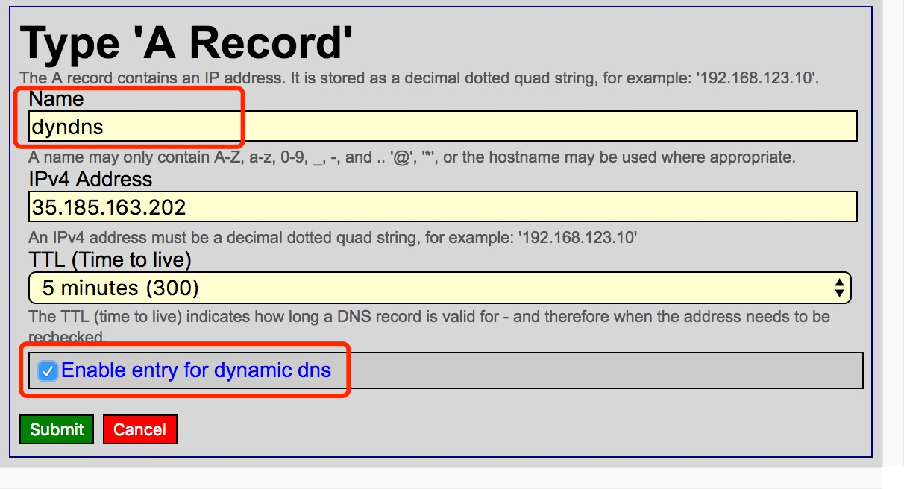
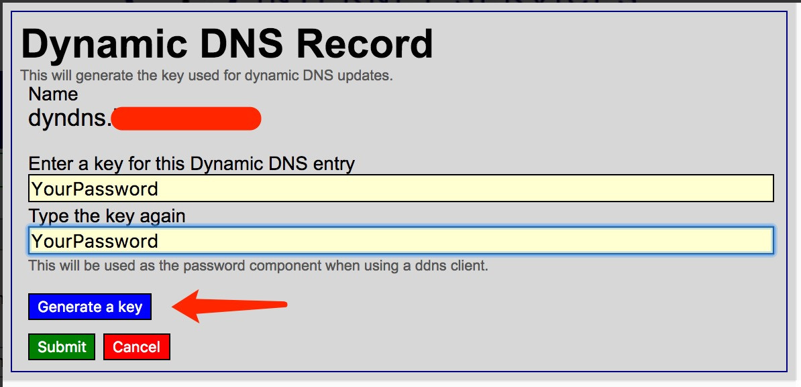

```text
 ██████╗  ██████╗ ██████╗ ███╗   ██╗███████╗
██╔════╝ ██╔═══██╗██╔══██╗████╗  ██║██╔════╝
██║  ███╗██║   ██║██║  ██║██╔██╗ ██║███████╗
██║   ██║██║   ██║██║  ██║██║╚██╗██║╚════██║
╚██████╔╝╚██████╔╝██████╔╝██║ ╚████║███████║
 ╚═════╝  ╚═════╝ ╚═════╝ ╚═╝  ╚═══╝╚══════╝
 ```

[![Apache licensed][9]][10] [![Docker][3]][4] [![Go Report Card][11]][12] [![Cover.Run][15]][16] [![GoDoc][13]][14]

[3]: https://img.shields.io/docker/image-size/timothyye/godns/latest
[4]: https://hub.docker.com/r/timothyye/godns
[9]: https://img.shields.io/badge/license-Apache-blue.svg
[10]: LICENSE
[11]: https://goreportcard.com/badge/github.com/timothyye/godns
[12]: https://goreportcard.com/report/github.com/timothyye/godns
[13]: https://godoc.org/github.com/TimothyYe/godns?status.svg
[14]: https://godoc.org/github.com/TimothyYe/godns
[15]: https://img.shields.io/badge/cover.run-88.2%25-green.svg
[16]: https://cover.run/go/github.com/timothyye/godns

[GoDNS](https://github.com/TimothyYe/godns) is a dynamic DNS (DDNS) client tool. It is a rewrite in [Go](https://golang.org) of my early [DynDNS](https://github.com/TimothyYe/DynDNS) open source project.

Currently supports updating A records for subdomains. Doesn't support updating of root domains.

---
- [Supported DNS Providers](#supported-dns-providers)
- [Supported Platforms](#supported-platforms)
- [Pre-conditions](#pre-conditions)
- [Installation](#installation)
- [Usage](#usage)
- [Configuration](#configuration)
  - [Overview](#overview)
  - [Configuration file format](#configuration-file-format)
  - [Configuration properties](#configuration-properties)
  - [Update root domain](#update-root-domain)
  - [Configuration examples](#configuration-examples)
    - [Cloudflare](#cloudflare)
    - [DNSPod](#dnspod)
    - [Dreamhost](#dreamhost)
    - [Dynv6](#dynv6)
    - [Google Domains](#google-domains)
    - [AliDNS](#alidns)
    - [DuckDNS](#duckdns)
    - [No-IP](#no-ip)
    - [HE.net](#henet)
    - [Scaleway](#scaleway)
  - [Notifications](#notifications)
    - [Email](#email)
    - [Telegram](#telegram)
    - [Slack](#slack)
    - [Discord](#discord)
  - [Miscellaneous topics](#miscellaneous-topics)
    - [IPv6 support](#ipv6-support)
    - [Network interface IP address](#network-interface-ip-address)
    - [SOCKS5 proxy support](#socks5-proxy-support)
    - [Display debug info](#display-debug-info)
- [Running GoDNS](#running-godns)
  - [As a manual daemon](#as-a-manual-daemon)
  - [As a managed daemon (with upstart)](#as-a-managed-daemon-with-upstart)
  - [As a managed daemon (with systemd)](#as-a-managed-daemon-with-systemd)
  - [As a Docker container](#as-a-docker-container)
  - [As a Windows service](#as-a-windows-service)
- [Special Thanks](#special-thanks)

---
## Supported DNS Providers

| Provider                              |   IPv4  support    |    IPv6 support    |    Root Domain     |     Subdomains     |
| ------------------------------------- | :----------------: | :----------------: | :----------------: | :----------------: |
| [Cloudflare][cloudflare]              | :white_check_mark: | :white_check_mark: | :white_check_mark: | :white_check_mark: |
| [Google Domains][google.domains]      | :white_check_mark: | :white_check_mark: |        :x:         | :white_check_mark: |
| [DNSPod][dnspod]                      | :white_check_mark: | :white_check_mark: | :white_check_mark: | :white_check_mark: |
| [Dynv6][dynv6]                        | :white_check_mark: | :white_check_mark: |        :x:         | :white_check_mark: |
| [HE.net (Hurricane Electric)][he.net] | :white_check_mark: | :white_check_mark: | :white_check_mark: | :white_check_mark: |
| [AliDNS][alidns]                      | :white_check_mark: | :white_check_mark: | :white_check_mark: | :white_check_mark: |
| [DuckDNS][duckdns]                    | :white_check_mark: | :white_check_mark: |        :x:         | :white_check_mark: |
| [Dreamhost][dreamhost]                | :white_check_mark: | :white_check_mark: |        :x:         | :white_check_mark: |
| [No-IP][no-ip]                        | :white_check_mark: | :white_check_mark: |        :x:         | :white_check_mark: |
| [Scaleway][Scaleway]                  | :white_check_mark: | :white_check_mark: | :white_check_mark: | :white_check_mark: |

[cloudflare]: https://cloudflare.com
[google.domains]: https://domains.google
[dnspod]: https://www.dnspod.cn
[dynv6]: https://dynv6.com
[he.net]: https://dns.he.net
[alidns]: https://help.aliyun.com/product/29697.html
[duckdns]: https://www.duckdns.org
[dreamhost]: https://www.dreamhost.com
[no-ip]: https://www.noip.com
[Scaleway]: https://www.scaleway.com/

Tip: You can follow this [issue](https://github.com/TimothyYe/godns/issues/76) to view the current status of DDNS for root domains.

## Supported Platforms

* Linux
* MacOS
* ARM Linux (Raspberry Pi, etc.)
* Windows
* MIPS32 platform

  To compile binaries for MIPS (mips or mipsle), run:

  ```bash
  GOOS=linux GOARCH=mips/mipsle GOMIPS=softfloat go build -a
  ```

  The binary can run on routers as well.

## Pre-conditions

To use GoDNS, it is assumed:
* You registered (now own) a domain
* Domain was delegated to a supported [DNS provider](#supported-dns-providers) (i.e. it has nameserver `NS` records pointing at a supported provider)

Alternatively, you can sign in to [DuckDNS](https://www.duckdns.org) (with a social account) and get a subdomain on the duckdns.org domain for free.

## Installation

Build GoDNS by running (from the root of the repository):

```bash
cd cmd/godns        # go to the GoDNS directory
go mod download     # get dependencies
go build            # build
```

You can also download a compiled binary from the [releases](https://github.com/TimothyYe/godns/releases).
## Usage

Print usage/help by running:

```bash
$ ./godns -h
Usage of ./godns:
  -c string
        Specify a config file (default "./config.json")
  -h    Show help
```

## Configuration

### Overview

* Make a copy of [config_sample.json](configs/config_sample.json) and name it as `config.json`, or make a copy of [config_sample.yaml](configs/config_sample.yaml) and name it as `config.yaml`.
* Configure your provider, domain/subdomain info, credentials, etc.
* Configure a notification medium (e.g. SMTP to receive emails) to get notified when your IP address changes
* Place the file in the same directory of GoDNS or use the `-c=path/to/your/file.json` option

### Configuration file format

GoDNS supports 2 different configuration file formats:

* JSON
* YAML

By default, GoDNS uses `JSON` config file. However, you can specify to use the `YAML` format via: `./godns -c /path/to/config.yaml` 

### Configuration properties

* `provider` — One of the [supported provider to use](#supported-dns-providers): `Cloudflare`, `Google`, `DNSPod`, `AliDNS`, `HE`, `DuckDNS` or `Dreamhost`.
* `email` — Email or account name of the DNS provider.
* `password` — Password of the DNS provider.
* `login_token` — API token of the DNS provider.
* `domains` — Domains list, with your sub domains.
* `ip_url` — A URL for fetching one's public IPv4 address.
* `ipv6_url` — A URL for fetching one's public IPv6 address.
* `ip_type` — Switch deciding if IPv4 or IPv6 should be used (when [supported](#supported-dns-providers)). Available values: `IPv4` or `IPv6`.
* `interval` — How often (in seconds) the public IP should be updated.
* `socks5_proxy` — Socks5 proxy server.
* `resolver` — Address of a public DNS server to use. For instance to use [Google's public DNS](https://developers.google.com/speed/public-dns/docs/using), you can set `8.8.8.8` when using GoDNS in IPv4 mode or `2001:4860:4860::8888` in IPv6 mode.

### Update root domain

By simply putting `@` into `sub_domains`, for example:

```json
"domains": [{
      "domain_name": "example.com",
      "sub_domains": ["@"]
    }]
```

### Configuration examples

#### Cloudflare

For Cloudflare, you need to provide the email & Global API Key as password (or to use the API token) and config all the domains & subdomains.

<details>
<summary>Using email & Global API Key</summary>

```json
{
  "provider": "Cloudflare",
  "email": "you@example.com",
  "password": "Global API Key",
  "domains": [{
      "domain_name": "example.com",
      "sub_domains": ["www","test"]
    },{
      "domain_name": "example2.com",
      "sub_domains": ["www","test"]
    }
  ],
  "resolver": "8.8.8.8",
  "ip_url": "https://api.ip.sb/ip",
  "ip_type": "IPv4",
  "interval": 300,
  "socks5_proxy": ""
}
```
</details>

<details>
<summary>Using the API Token</summary>

```json
{
  "provider": "Cloudflare",
  "login_token": "API Token",
  "domains": [{
      "domain_name": "example.com",
      "sub_domains": ["www","test"]
    },{
      "domain_name": "example2.com",
      "sub_domains": ["www","test"]
    }
  ],
  "resolver": "8.8.8.8",
  "ip_url": "https://api.ip.sb/ip",
  "ip_type": "IPv4",
  "interval": 300,
  "socks5_proxy": ""
}
```
</details>

#### DNSPod

For DNSPod, you need to provide your API Token(you can create it [here](https://www.dnspod.cn/console/user/security)), and config all the domains & subdomains.

<details>
<summary>Example</summary>

```json
{
  "provider": "DNSPod",
  "login_token": "your_id,your_token",
  "domains": [{
      "domain_name": "example.com",
      "sub_domains": ["www","test"]
    },{
      "domain_name": "example2.com",
      "sub_domains": ["www","test"]
    }
  ],
  "resolver": "8.8.8.8",
  "ip_url": "https://api.ip.sb/ip",
  "ip_type": "IPv4",
  "interval": 300,
  "socks5_proxy": ""
}
```
</details>

#### Dreamhost

For Dreamhost, you need to provide your API Token(you can create it [here](https://panel.dreamhost.com/?tree=home.api)), and config all the domains & subdomains.

<details>
<summary>Example</summary>

```json
{
  "provider": "Dreamhost",
  "login_token": "your_api_key",
  "domains": [{
      "domain_name": "example.com",
      "sub_domains": ["www","test"]
    },{
      "domain_name": "example2.com",
      "sub_domains": ["www","test"]
    }
  ],
  "resolver": "8.8.8.8",
  "ip_url": "https://api.ip.sb/ip",
  "ip_type": "IPv4",
  "interval": 300,
  "resolver": "ns1.dreamhost.com",
  "socks5_proxy": ""
}
```
</details>

#### Dynv6

For Dynv6, only need to provide the `token`, config 1 default domain & subdomains.

<details>
<summary>Example</summary>

```json
{
  "provider": "Dynv6",
  "password": "",
  "login_token": "1234567ABCDEFGabcdefg123456789",
  "domains": [
    {
      "domain_name": "dynv6.net",
      "sub_domains": [
        "myname"
      ]
    }
  ],
  "resolver": "8.8.8.8",
  "ip_url": "https://api.ip.sb/ip",
  "ip_type": "IPv4",
  "interval": 300,
  "socks5_proxy": ""
}
```
</details>

#### Google Domains

For Google Domains, you need to provide email & password, and config all the domains & subdomains.

<details>
<summary>Example</summary>

```json
{
  "provider": "Google",
  "email": "Your_Username",
  "password": "Your_Password",
  "domains": [{
      "domain_name": "example.com",
      "sub_domains": ["www","test"]
    },{
      "domain_name": "example2.com",
      "sub_domains": ["www","test"]
    }
  ],
  "resolver": "8.8.8.8",
  "ip_url": "https://api.ip.sb/ip",
  "ip_type": "IPv4",
  "interval": 300,
  "socks5_proxy": ""
}
```
</details>

#### AliDNS

For AliDNS, you need to provide `AccessKeyID` & `AccessKeySecret` as `email` & `password`,  and config all the domains & subdomains.

<details>
<summary>Example</summary>

```json
{
  "provider": "AliDNS",
  "email": "AccessKeyID",
  "password": "AccessKeySecret",
  "login_token": "",
  "domains": [{
      "domain_name": "example.com",
      "sub_domains": ["www","test"]
    },{
      "domain_name": "example2.com",
      "sub_domains": ["www","test"]
    }
  ],
  "resolver": "8.8.8.8",
  "ip_url": "https://api.ip.sb/ip",
  "ip_type": "IPv4",
  "interval": 300,
  "socks5_proxy": ""
}
```
</details>

#### DuckDNS

For DuckDNS, only need to provide the `token`, config 1 default domain & subdomains.

<details>
<summary>Example</summary>

```json
{
  "provider": "DuckDNS",
  "password": "",
  "login_token": "3aaaaaaaa-f411-4198-a5dc-8381cac61b87",
  "domains": [
    {
      "domain_name": "www.duckdns.org",
      "sub_domains": [
        "myname"
      ]
    }
  ],
  "resolver": "8.8.8.8",
  "ip_url": "https://api.ip.sb/ip",
  "ip_type": "IPv4",
  "interval": 300,
  "socks5_proxy": ""
}
```
</details>

#### No-IP

<details>
<summary>Example</summary>

```json
{
  "provider": "NoIP",
  "email": "mail@example.com",
  "password": "YourPassword",
  "domains": [
    {
      "domain_name": "ddns.net",
      "sub_domains": ["timothyye6"]
    }
  ],
  "ip_type": "IPv4",
  "ip_url": "https://api.ip.sb/ip",
  "resolver": "8.8.8.8",
  "interval": 300,
  "socks5_proxy": ""
}
```
</details>

#### HE.net

For HE, email is not needed, just fill DDNS key to password, and config all the domains & subdomains.

<details>
<summary>Example</summary>

```json
{
  "provider": "HE",
  "password": "YourPassword",
  "login_token": "",
  "domains": [{
      "domain_name": "example.com",
      "sub_domains": ["www","test"]
    },{
      "domain_name": "example2.com",
      "sub_domains": ["www","test"]
    }
  ],
  "resolver": "8.8.8.8",
  "ip_url": "https://api.ip.sb/ip",
  "ip_type": "IPv4",
  "interval": 300,
  "socks5_proxy": ""
}
```
</details>

<details>
<summary>Provider configuration</summary>

Add a new "A record" and make sure that "Enable entry for dynamic dns" is checked:



Fill in your own DDNS key or generate a random DDNS key for this new created "A record":



Remember the DDNS key and set it in the `password` property in the configuration file.

__NOTICE__: If you have multiple domains or subdomains, make sure their DDNS key are the same.
</details>

#### Scaleway

For Scaleway, you need to provide an API Secret Key as the `login_token` ([How to generate an API key](https://www.scaleway.com/en/docs/generate-api-keys/)), and configure the domains and subdomains. `domain_name` should equal a DNS zone, or the root domain in Scaleway. TTL for the DNS records will be set to the `interval` value. Make sure `A` or `AAAA` records exist for the relevant sub domains, these can be set up in the [Scaleway console](https://www.scaleway.com/en/docs/scaleway-dns/#-Managing-Records).

<details>
<summary>Example</summary>
 
```json
{
  "provider": "Scaleway",
  "login_token": "API Secret Key",
  "domains": [{
      "domain_name": "example.com",
      "sub_domains": ["www","@"]
    },{
      "domain_name": "samplednszone.example.com",
      "sub_domains": ["www","test"]
    }
  ],
  "resolver": "8.8.8.8",
  "ip_url": "https://api.ip.sb/ip",
  "ip_type": "IPv4",
  "interval": 300
}
```
</details>

### Notifications

GoDNS can send a notification each time the IP changes.

#### Email

Emails are sent over [SMTP](https://en.wikipedia.org/wiki/Simple_Mail_Transfer_Protocol). Update your configuration with the following snippet:

```json
  "notify": {
    "mail": {
      "enabled": true,
      "smtp_server": "smtp.example.com",
      "smtp_username": "user",
      "smtp_password": "password",
      "smtp_port": 25,
      "send_to": "my_mail@example.com"
    }
  }
```

Each time the IP changes, you will receive an email like that:


#### Telegram

To receive a [Telegram](https://telegram.org/) message each time the IP changes, update your configuration with the following snippet:

```json
  "notify": {
    "telegram": {
      "enabled": true,
      "bot_api_key": "11111:aaaa-bbbb",
      "chat_id": "-123456",
      "message_template": "Domain *{{ .Domain }}* is updated to %0A{{ .CurrentIP }}",
      "use_proxy": false
    },
  }
```

The `message_template` property supports [markdown](https://www.markdownguide.org). New lines needs to be escaped with `%0A`.

#### Slack

To receive a [Slack](https://slack.com) message each time the IP changes, update your configuration with the following snippet:

```json
  "notify": {
    "slack": {
      "enabled": true,
      "bot_api_token": "xoxb-xxx",
      "channel": "your_channel",
      "message_template": "Domain *{{ .Domain }}* is updated to \n{{ .CurrentIP }}",
      "use_proxy": false
    },
  }
```

The `message_template` property supports [markdown](https://www.markdownguide.org). New lines needs to be escaped with `\n`.

#### Discord

To receive a [Discord](https://discord.gg) message each time the IP changes, update your configuration with the following snippit:

```json
  "notify": {
    "discord": {
          "enabled": true,
          "bot_api_token": "discord_bot_token",
          "channel": "your_channel",
          "message_template": "(Optional) Domain *{{ .Domain }}* is updated to \n{{ .CurrentIP }}",
        }
  }
```

### Miscellaneous topics

#### IPv6 support

Most of the [providers](#supported-dns-providers) support IPv6.

To enable the `IPv6` support of GoDNS, there are two solutions to choose from:

1. Use an online service to lookup the external IPv6

   For that:

   - Set the `ip_type` as `IPv6`, and make sure the `ipv6_url` is configured
   - Create an `AAAA` record instead of an `A` record in your DNS provider

   <details>
   <summary>Configuration example</summary>

   ```json
   {
     "domains": [
       {
         "domain_name": "example.com",
         "sub_domains": [
           "ipv6"
         ]
       }
     ],
     "resolver": "2001:4860:4860::8888",
     "ipv6_url": "https://api-ipv6.ip.sb/ip",
     "ip_type": "IPv6"
   }
   ```
   </details>


2. Let GoDNS find the IPv6 of the network interface of the machine it is running on (more on that [later](#network-interface-ip-address)).

   For this to happen, just leave `ip_url` and `ipv6_url` empty.

   Note that the network interface must be configured with an IPv6 for this to work.

#### Network interface IP address

For some reasons if you want to get the IP address associated to a network interface (instead of performing an online lookup), you can specify it in the configuration file this way:

```json
  "ip_url": "",
  "ip_interface": "interface-name",
```

With `interface-name` replaced by the name of the network interface, e.g. `eth0` on Linux or `Local Area Connection` on Windows.

Note: If `ip_url` is also specified, it will be used to perform an online lookup first and the network interface IP will be used as a fallback in case of failure.

#### SOCKS5 proxy support

You can make all remote calls go through a [SOCKS5 proxy](https://en.wikipedia.org/wiki/SOCKS#SOCKS5) by specifying it in the configuration file this way:

```json
"socks5_proxy": "127.0.0.1:7070"
"use_proxy": true
```

#### Display debug info 

To display debug info, set `debug_info` as `true` to enable this feature. By default, the debug info is disabled.

```json
  "debug_info": true,
```

## Running GoDNS

There are a few ways to run GoDNS.

### As a manual daemon

```bash
nohup ./godns &
```

Note: when the program stops, it will not be restarted.

### As a managed daemon (with upstart)

1. Install `upstart` first (if not available already)
2. Copy `./upstart/godns.conf` to `/etc/init` (and tweak it to your needs)
3. Start the service:

   ```bash
   sudo start godns
   ```

### As a managed daemon (with systemd)

1. Install `systemd` first (it not available already)
2. Copy `./systemd/godns.service` to `/lib/systemd/system` (and tweak it to your needs)
3. Start the service:

   ```bash
   sudo systemctl enable godns
   sudo systemctl start godns
   ```

### As a Docker container

Visit https://hub.docker.com/r/timothyye/godns to fetch the latest docker image.  
With `/path/to/config.json` your local configuration file, run:

```bash
docker run \
-d --name godns --restart=always \
-v /path/to/config.json:/config.json \
timothyye/godns:latest
```

### As a Windows service

1. Download the latest version of [NSSM](https://nssm.cc/download)

2. In an administrative prompt, from the folder where NSSM was downloaded, e.g. `C:\Downloads\nssm\` **win64**, run:

   ```
   nssm install YOURSERVICENAME
   ```

3. Follow the interface to configure the service. In the "Application" tab just indicate where the `godns.exe` file is. Optionally you can also define a description on the "Details" tab and define a log file on the "I/O" tab. Finish by clicking on the "Install service" button.

4. The service will now start along Windows.

Note: you can uninstall the service by running:

```
nssm remove YOURSERVICENAME
```

## Special Thanks


Thanks JetBrains for sponsoring this project with [free open source license](https://www.jetbrains.com/community/opensource/).

> I like GoLand, it is an amazing and productive tool.
