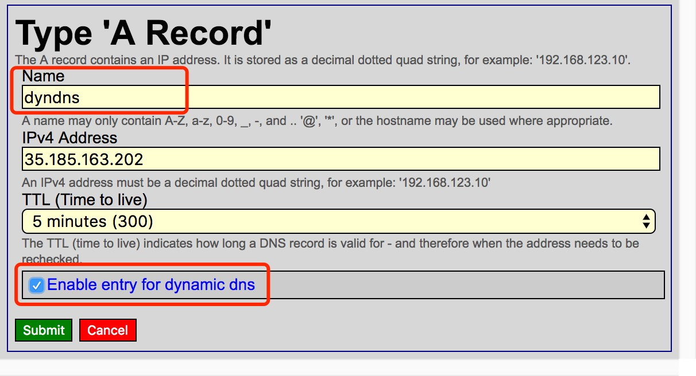
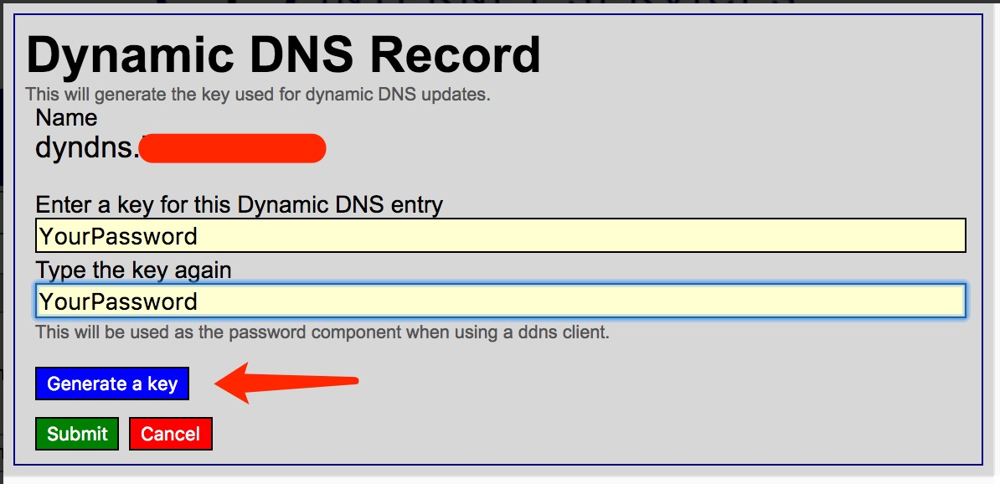

```text
 ██████╗  ██████╗ ██████╗ ███╗   ██╗███████╗
██╔════╝ ██╔═══██╗██╔══██╗████╗  ██║██╔════╝
██║  ███╗██║   ██║██║  ██║██╔██╗ ██║███████╗
██║   ██║██║   ██║██║  ██║██║╚██╗██║╚════██║
╚██████╔╝╚██████╔╝██████╔╝██║ ╚████║███████║
 ╚═════╝  ╚═════╝ ╚═════╝ ╚═╝  ╚═══╝╚══════╝
```

[![Apache licensed][9]][10] [![Docker][3]][4] [![Go Report Card][11]][12] [![GoDoc][13]][14]

[3]: https://img.shields.io/docker/image-size/timothyye/godns/latest
[4]: https://hub.docker.com/r/timothyye/godns
[9]: https://img.shields.io/badge/license-Apache-blue.svg
[10]: LICENSE
[11]: https://goreportcard.com/badge/github.com/timothyye/godns
[12]: https://goreportcard.com/report/github.com/timothyye/godns
[13]: https://godoc.org/github.com/TimothyYe/godns?status.svg
[14]: https://godoc.org/github.com/TimothyYe/godns

[GoDNS](https://github.com/TimothyYe/godns) 是一个支持多提供商并内置 Web 面板的开源自建动态 DNS (DDNS) 客户端。它是用 [Go](https://golang.org) 重写的我早期的 [DynDNS](https://github.com/TimothyYe/DynDNS) 开源项目。

## 托管版服务

如果你希望直接使用托管式 DDNS 服务，而不是自己部署 GoDNS，可以试试 [godns.app](https://godns.app)。

它更适合那些不想自己搭服务器、不想手动维护 DNS 流程，甚至还没有自己域名的用户。

下面展示的是开源版 GoDNS 内置的 Web UI：


- [支持的 DNS 提供商](#支持的-dns-提供商)
- [快速开始](#快速开始)
- [支持的平台](#支持的平台)
- [开源自建版前提条件](#开源自建版前提条件)
- [安装](#安装)
- [配置](#配置)
- [Web 面板](#web-面板)
- [运行 GoDNS](#运行-godns)
- [贡献](#贡献)

---

## 支持的 DNS 提供商

| 提供商                                |     IPv4 支持      |     IPv6 支持      |       根域名       |       子域名       |
| ------------------------------------- | :----------------: | :----------------: | :----------------: | :----------------: |
| [Cloudflare][cloudflare]              | :white_check_mark: | :white_check_mark: | :white_check_mark: | :white_check_mark: |
| [DigitalOcean][digitalocean]          | :white_check_mark: | :white_check_mark: | :white_check_mark: | :white_check_mark: |
| [Google Domains][google.domains]      | :white_check_mark: | :white_check_mark: |        :x:         | :white_check_mark: |
| [DNSPod][dnspod]                      | :white_check_mark: | :white_check_mark: | :white_check_mark: | :white_check_mark: |
| [Dynv6][dynv6]                        | :white_check_mark: | :white_check_mark: |        :x:         | :white_check_mark: |
| [HE.net (Hurricane Electric)][he.net] | :white_check_mark: | :white_check_mark: | :white_check_mark: | :white_check_mark: |
| [AliDNS][alidns]                      | :white_check_mark: | :white_check_mark: | :white_check_mark: | :white_check_mark: |
| [DuckDNS][duckdns]                    | :white_check_mark: | :white_check_mark: |        :x:         | :white_check_mark: |
| [Dreamhost][dreamhost]                | :white_check_mark: | :white_check_mark: |        :x:         | :white_check_mark: |
| [No-IP][no-ip]                        | :white_check_mark: | :white_check_mark: |        :x:         | :white_check_mark: |
| [Scaleway][scaleway]                  | :white_check_mark: | :white_check_mark: | :white_check_mark: | :white_check_mark: |
| [Linode][linode]                      | :white_check_mark: | :white_check_mark: | :white_check_mark: | :white_check_mark: |
| [Strato][strato]                      | :white_check_mark: | :white_check_mark: |        :x:         | :white_check_mark: |
| [LoopiaSE][loopiase]                  | :white_check_mark: | :white_check_mark: |        :x:         | :white_check_mark: |
| [Infomaniak][infomaniak]              | :white_check_mark: | :white_check_mark: |        :x:         | :white_check_mark: |
| [Hetzner][hetzner]                    | :white_check_mark: | :white_check_mark: | :white_check_mark: | :white_check_mark: |
| [OVH][ovh]                            | :white_check_mark: | :white_check_mark: |        :x:         | :white_check_mark: |
| [Porkbun][porkbun]                    | :white_check_mark: | :white_check_mark: | :white_check_mark: | :white_check_mark: |
| [Dynu][dynu]                          | :white_check_mark: | :white_check_mark: |        :x:         | :white_check_mark: |
| [IONOS][ionos]                        | :white_check_mark: | :white_check_mark: |        :x:         | :white_check_mark: |
| [TransIP][transip]                    | :white_check_mark: | :white_check_mark: |        :x:         | :white_check_mark: |

[cloudflare]: https://cloudflare.com
[digitalocean]: https://digitalocean.com
[google.domains]: https://domains.google
[dnspod]: https://www.dnspod.cn
[dynv6]: https://dynv6.com
[he.net]: https://dns.he.net
[alidns]: https://help.aliyun.com/product/29697.html
[duckdns]: https://www.duckdns.org
[dreamhost]: https://www.dreamhost.com
[no-ip]: https://www.noip.com
[scaleway]: https://www.scaleway.com/
[linode]: https://www.linode.com
[strato]: https://strato.de
[loopiase]: https://www.loopia.se/
[infomaniak]: https://www.infomaniak.com/
[hetzner]: https://hetzner.com/
[ovh]: https://www.ovh.com
[porkbun]: https://porkbun.com/
[dynu]: https://www.dynu.com/
[ionos]: https://www.ionos.com/
[transip]: https://www.transip.net/

提示：您可以关注此 [问题](https://github.com/TimothyYe/godns/issues/76) 查看根域名 DDNS 的当前状态。

## 快速开始

请选择最适合你的方式：

- 如果你想直接使用托管服务而不自建：使用 [godns.app](https://godns.app)。
- 如果你想最快速地开始自建：从 [releases](https://github.com/TimothyYe/godns/releases) 下载二进制文件。
- 如果你想用容器运行：直接看 [作为 Docker 容器](#作为-docker-容器)。
- 如果你想从源码构建：看 [安装](#安装)。

## 支持的平台

- Linux
- MacOS
- ARM Linux（如 Raspberry Pi 等）
- Windows
- MIPS32 平台

  要为 MIPS（mips 或 mipsle）编译二进制文件，请运行：

  ```bash
  GOOS=linux GOARCH=mips/mipsle GOMIPS=softfloat go build -a
  ```

  该二进制文件也可以在路由器上运行。

## 开源自建版前提条件

要自建部署 GoDNS，假设：

- 您已注册（现在拥有）一个域名
- 域名已委托给受支持的 [DNS 提供商](#支持的-dns-提供商)（即它有指向受支持提供商的 nameserver `NS` 记录）

或者，您可以登录 [DuckDNS](https://www.duckdns.org)（使用社交账户），免费获取 duckdns.org 域名下的子域名。

## 安装

你可以选择以下安装方式之一：

- 从 [releases](https://github.com/TimothyYe/godns/releases) 下载已编译的二进制文件。
- 使用 [作为 Docker 容器](#作为-docker-容器) 中描述的 Docker 镜像。
- 从源码构建：

```bash
cd cmd/godns        # 进入 GoDNS 目录
go mod download     # 获取依赖项
go build            # 构建
```

## 使用方法

通过运行以下命令打印使用/帮助信息：

```bash
$ ./godns -h
Usage of ./godns:
  -c string
        指定配置文件（默认 "./config.json"）
  -h    显示帮助
```

## 配置

### 概述

- 复制 [config_sample.json](configs/config_sample.json) 并命名为 `config.json`，或者复制 [config_sample.yaml](configs/config_sample.yaml) 并命名为 `config.yaml`。
- 配置您的提供商、域名/子域名信息、凭据等。
- 配置通知媒介（例如 SMTP 接收电子邮件），以便在您的 IP 地址更改时收到通知
- 将文件放置在 GoDNS 的同一目录中，或者使用 `-c=path/to/your/file.json` 选项

### 多提供商支持

🆕 **GoDNS 现已支持同时使用多个 DNS 提供商！**

您现在可以在单个配置文件中配置来自不同 DNS 提供商的域名，从而实现：
- 跨多个 DNS 服务（Cloudflare、DNSPod、DigitalOcean 等）管理域名
- 为每个服务使用提供商特定的凭据
- 与现有单提供商配置保持完全向后兼容

📖 **[查看完整的多提供商配置指南](MULTI_PROVIDER_CN.md)** 了解详细的设置说明和示例。

### 配置文件格式

GoDNS 支持两种不同的配置文件格式：

- JSON
- YAML

默认情况下，GoDNS 使用 `JSON` 配置文件。但是，您可以通过 `./godns -c /path/to/config.yaml` 指定使用 `YAML` 格式。

### 动态加载配置

GoDNS 支持动态加载配置。如果您修改了配置文件，GoDNS 将自动重新加载配置并应用更改。

### 配置属性

- `provider` — 使用的一个 [支持的提供商](#支持的-dns-提供商)：`Cloudflare`、`Google`、`DNSPod`、`AliDNS`、`HE`、`DuckDNS` 或 `Dreamhost`。
- `email` — DNS 提供商的电子邮件或账户名。
- `password` — DNS 提供商的密码。
- `login_token` — DNS 提供商的 API 令牌。
- `domains` — 域名列表，包含您的子域名。
- `ip_urls` — 用于获取公共 IPv4 地址的 URL 数组。
- `ipv6_urls` — 用于获取公共 IPv6 地址的 URL 数组。
- `ip_type` — 决定使用 IPv4 还是 IPv6 的开关（当 [支持](#支持的-dns-提供商) 时）。可用值：`IPv4` 或 `IPv6`。
- `interval` — 公共 IP 更新的频率（以秒为单位）。
- `socks5_proxy` — Socks5 代理服务器。
- `resolver` — 要使用的公共 DNS 服务器地址。例如，要使用 [Google 的公共 DNS](https://developers.google.com/speed/public-dns/docs/using)，您可以在使用 GoDNS 的 IPv4 模式时设置 `8.8.8.8`，或在 IPv6 模式时设置 `2001:4860:4860::8888`。
- `skip_ssl_verify` - 跳过对 https 请求的 SSL 证书验证。

### 更新根域名

只需将 `@` 放入 `sub_domains`，例如：

```json
"domains": [{
      "domain_name": "example.com",
      "sub_domains": ["@"]
    }]
```

### 配置示例

#### Cloudflare

对于 Cloudflare，您需要提供电子邮件和全局 API 密钥作为密码（或使用 API 令牌），并配置所有域名和子域名。

通过设置选项 `proxied = true`，记录将获得 Cloudflare 的性能和安全优势。此选项仅适用于 Cloudflare。

<details>
<summary>使用电子邮件和全局 API 密钥</summary>

```json
{
  "provider": "Cloudflare",
  "email": "you@example.com",
  "password": "Global API Key",
  "domains": [
    {
      "domain_name": "example.com",
      "sub_domains": ["www", "test"]
    },
    {
      "domain_name": "example2.com",
      "sub_domains": ["www", "test"]
    }
  ],
  "resolver": "8.8.8.8",
  "ip_urls": ["https://api.ip.sb/ip"],
  "ip_type": "IPv4",
  "interval": 300,
  "socks5_proxy": "",
  "proxied": false
}
```

</details>

<details>
<summary>使用 API 令牌</summary>

```json
{
  "provider": "Cloudflare",
  "login_token": "API Token",
  "domains": [
    {
      "domain_name": "example.com",
      "sub_domains": ["www", "test"]
    },
    {
      "domain_name": "example2.com",
      "sub_domains": ["www", "test"]
    }
  ],
  "resolver": "8.8.8.8",
  "ip_urls": ["https://api.ip.sb/ip"],
  "ip_type": "IPv4",
  "interval": 300,
  "socks5_proxy": ""
}
```

</details>

#### DNSPod

对于 DNSPod，您需要提供您的 API 令牌（您可以在[这里](https://www.dnspod.cn/console/user/security)创建），并配置所有域名和子域名。

<details>
<summary>示例</summary>

```json
{
  "provider": "DNSPod",
  "login_token": "your_id,your_token",
  "domains": [
    {
      "domain_name": "example.com",
      "sub_domains": ["www", "test"]
    },
    {
      "domain_name": "example2.com",
      "sub_domains": ["www", "test"]
    }
  ],
  "resolver": "8.8.8.8",
  "ip_urls": ["https://api.ip.sb/ip"],
  "ip_type": "IPv4",
  "interval": 300,
  "socks5_proxy": ""
}
```

</details>

#### DigitalOcean

对于 DigitalOcean，您需要提供一个具有 `domain` 范围的 API 令牌（您可以在[这里](https://cloud.digitalocean.com/account/api/tokens/new)创建），并配置所有域名和子域名。

<details>
<summary>示例</summary>

```json
{
  "provider": "DigitalOcean",
  "login_token": "dop_v1_00112233445566778899aabbccddeeff",
  "domains": [
    {
      "domain_name": "example.com",
      "sub_domains": ["@", "www"]
    }
  ],
  "resolver": "8.8.8.8",
  "ip_urls": ["https://api.ip.sb/ip"],
  "ip_type": "IPv4",
  "interval": 300
}
```

</details>

#### Dreamhost

对于 Dreamhost，您需要提供您的 API 令牌（您可以在[这里](https://panel.dreamhost.com/?tree=home.api)创建），并配置所有域名和子域名。

<details>
<summary>示例</summary>

```json
{
  "provider": "Dreamhost",
  "login_token": "your_api_key",
  "domains": [
    {
      "domain_name": "example.com",
      "sub_domains": ["www", "test"]
    },
    {
      "domain_name": "example2.com",
      "sub_domains": ["www", "test"]
    }
  ],
  "resolver": "8.8.8.8",
  "ip_urls": ["https://api.ip.sb/ip"],
  "ip_type": "IPv4",
  "interval": 300,
  "resolver": "ns1.dreamhost.com",
  "socks5_proxy": ""
}
```

</details>

#### Dynv6

对于 Dynv6，只需提供 `token`，配置 1 个默认域名和子域名。

<details>
<summary>示例</summary>

```json
{
  "provider": "Dynv6",
  "password": "",
  "login_token": "1234567ABCDEFGabcdefg123456789",
  "domains": [
    {
      "domain_name": "dynv6.net",
      "sub_domains": ["myname"]
    }
  ],
  "resolver": "8.8.8.8",
  "ip_urls": ["https://api.ip.sb/ip"],
  "ip_type": "IPv4",
  "interval": 300,
  "socks5_proxy": ""
}
```

</details>

#### Google Domains

对于 Google Domains，您需要提供电子邮件和密码，并配置所有域名和子域名。

<details>
<summary>示例</summary>

```json
{
  "provider": "Google",
  "email": "Your_Username",
  "password": "Your_Password",
  "domains": [
    {
      "domain_name": "example.com",
      "sub_domains": ["www", "test"]
    },
    {
      "domain_name": "example2.com",
      "sub_domains": ["www", "test"]
    }
  ],
  "resolver": "8.8.8.8",
  "ip_urls": ["https://api.ip.sb/ip"],
  "ip_type": "IPv4",
  "interval": 300,
  "socks5_proxy": ""
}
```

</details>

#### AliDNS

对于 AliDNS，您需要提供 `AccessKeyID` 和 `AccessKeySecret` 作为 `email` 和 `password`，并配置所有域名和子域名。

<details>
<summary>示例</summary>

```json
{
  "provider": "AliDNS",
  "email": "AccessKeyID",
  "password": "AccessKeySecret",
  "login_token": "",
  "domains": [
    {
      "domain_name": "example.com",
      "sub_domains": ["www", "test"]
    },
    {
      "domain_name": "example2.com",
      "sub_domains": ["www", "test"]
    }
  ],
  "resolver": "8.8.8.8",
  "ip_urls": ["https://api.ip.sb/ip"],
  "ip_type": "IPv4",
  "interval": 300,
  "socks5_proxy": ""
}
```

</details>

#### DuckDNS

对于 DuckDNS，只需提供 `token`，配置 1 个默认域名和子域名。

<details>
<summary>示例</summary>

```json
{
  "provider": "DuckDNS",
  "password": "",
  "login_token": "3aaaaaaaa-f411-4198-a5dc-8381cac61b87",
  "domains": [
    {
      "domain_name": "www.duckdns.org",
      "sub_domains": ["myname"]
    }
  ],
  "resolver": "8.8.8.8",
  "ip_urls": ["https://api.ip.sb/ip"],
  "ip_type": "IPv4",
  "interval": 300,
  "socks5_proxy": ""
}
```

</details>

#### No-IP

<details>
<summary>示例</summary>

```json
{
  "provider": "NoIP",
  "email": "mail@example.com",
  "password": "YourPassword",
  "domains": [
    {
      "domain_name": "ddns.net",
      "sub_domains": ["timothyye6"]
    }
  ],
  "ip_type": "IPv4",
  "ip_urls": ["https://api.ip.sb/ip"],
  "resolver": "8.8.8.8",
  "interval": 300,
  "socks5_proxy": ""
}
```

</details>

#### HE.net

对于 HE，不需要电子邮件，只需填写 DDNS 密钥作为密码，并配置所有域名和子域名。

<details>
<summary>示例</summary>

```json
{
  "provider": "HE",
  "password": "Your DDNS Key",
  "login_token": "",
  "domains": [
    {
      "domain_name": "example.com",
      "sub_domains": ["www", "test"]
    },
    {
      "domain_name": "example2.com",
      "sub_domains": ["www", "test"]
    }
  ],
  "resolver": "8.8.8.8",
  "ip_urls": ["https://api.ip.sb/ip"],
  "ip_type": "IPv4",
  "interval": 300,
  "socks5_proxy": ""
}
```

</details>

<details>
<summary>提供商配置</summary>

添加一个新的 "A 记录" 并确保勾选 "启用动态 DNS 条目"：



填写您自己的 DDNS 密钥或为这个新创建的 "A 记录" 生成一个随机 DDNS 密钥：



记住 DDNS 密钥并在配置文件中设置到 `password` 属性中。

**注意**：如果您有多个域名或子域名，请确保它们的 DDNS 密钥相同。

</details>

#### Scaleway

对于 Scaleway，您需要提供 API 密钥作为 `login_token`（[如何生成 API 密钥](https://www.scaleway.com/en/docs/generate-api-keys/)），并配置域名和子域名。`domain_name` 应等于 Scaleway 中的 DNS 区域或根域名。DNS 记录的 TTL 将设置为 `interval` 值。确保相关子域名的 `A` 或 `AAAA` 记录存在，这些可以在 [Scaleway 控制台](https://www.scaleway.com/en/docs/scaleway-dns/#-Managing-Records) 中设置。

<details>
<summary>示例</summary>

```json
{
  "provider": "Scaleway",
  "login_token": "API Secret Key",
  "domains": [
    {
      "domain_name": "example.com",
      "sub_domains": ["www", "@"]
    },
    {
      "domain_name": "samplednszone.example.com",
      "sub_domains": ["www", "test"]
    }
  ],
  "resolver": "8.8.8.8",
  "ip_urls": ["https://api.ip.sb/ip"],
  "ip_type": "IPv4",
  "interval": 300
}
```

</details>

#### Linode

要与 Linode API 进行身份验证，您需要提供一个具有“读/写”访问权限的个人访问令牌，范围为“Domain”。Linode 有一个[关于创建访问令牌的帮助页面](https://www.linode.com/docs/guides/getting-started-with-the-linode-api/)。将此令牌传入配置文件中的 `login_token` 字段。

配置文件中的 `domain_name` 字段必须是 Linode 管理的现有域名的名称。Linode 有一个[关于添加域名的帮助页面](https://www.linode.com/docs/guides/dns-manager/)。GoDNS Linode 处理程序不会自动创建域名，但会自动创建子域名。

GoDNS Linode 处理程序目前对 Linode DNS 记录使用固定的 30 秒 TTL。

<details>
<summary>示例</summary>

```json
{
  "provider": "Linode",
  "login_token": ${PERSONAL_ACCESS_TOKEN},
  "domains": [{
      "domain_name": "example.com",
      "sub_domains": ["www","@"]
    },{
      "domain_name": "samplednszone.example.com",
      "sub_domains": ["www","test"]
    }
  ],
  "resolver": "8.8.8.8",
  "ip_urls": ["https://api.ip.sb/ip"],
  "ip_type": "IPv4",
  "interval": 300
}
```

</details>

#### Strato

对于 Strato，您需要提供电子邮件和密码，并配置所有域名和子域名。
更多信息：[德语](https://www.strato.de/faq/hosting/so-einfach-richten-sie-dyndns-fuer-ihre-domains-ein/) [英语](https://www.strato-hosting.co.uk/faq/hosting/this-is-how-easy-it-is-to-set-up-dyndns-for-your-domains/)

<details>
<summary>示例</summary>

```json
{
  "provider": "strato",
  "password": "Your_Password",
  "domains": [
    {
      "domain_name": "example.com",
      "sub_domains": ["www", "test"]
    },
    {
      "domain_name": "example2.com",
      "sub_domains": ["www", "test"]
    }
  ],
  "resolver": "8.8.8.8",
  "ip_urls": ["https://api.ip.sb/ip"],
  "ip_type": "IPv4",
  "interval": 300,
  "socks5_proxy": ""
}
```

</details>

#### LoopiaSE

对于 LoopiaSE，您需要提供用户名和密码，并配置所有域名和子域名。
更多信息：[瑞典语](https://support.loopia.se/wiki/om-dyndns-stodet/)

<details>
<summary>示例</summary>

```json
{
  "provider": "LoopiaSE",
  "email": "Your_Username",
  "password": "Your_Password",
  "domains": [
    {
      "domain_name": "example.com",
      "sub_domains": ["www", "test"]
    },
    {
      "domain_name": "example2.com",
      "sub_domains": ["www", "test"]
    }
  ],
  "resolver": "8.8.8.8",
  "ip_urls": ["https://api.ip.sb/ip"],
  "ip_type": "IPv4",
  "interval": 300,
  "socks5_proxy": ""
}
```

</details>

#### Infomaniak

对于 Infomaniak，您需要提供用户名和密码，并配置所有域名和子域名。
更多信息：[英语](https://faq.infomaniak.com/2376)

<details>
<summary>示例</summary>

```json
{
  "provider": "Infomaniak",
  "email": "Your_Username",
  "password": "Your_Password",
  "domains": [
    {
      "domain_name": "example.com",
      "sub_domains": ["www", "test"]
    },
    {
      "domain_name": "example2.com",
      "sub_domains": ["www", "test"]
    }
  ],
  "resolver": "8.8.8.8",
  "ip_urls": ["https://api.ip.sb/ip"],
  "ip_type": "IPv4",
  "interval": 300,
  "socks5_proxy": ""
}
```

</details>

#### Hetzner

对于 Hetzner，您必须创建一个访问令牌。这可以在 DNS 控制台中完成。
（左上角的个人图标 --> API 令牌）
注意：如果一个域名有多个记录，**只有第一个**记录会被更新。
确保只有一个记录。

<details>
<summary>示例</summary>

```json
{
  "provider": "hetzner",
  "login_token": "<token>",
  "domains": [
    {
      "domain_name": "example.com",
      "sub_domains": ["www", "test"]
    },
    {
      "domain_name": "example2.com",
      "sub_domains": ["www", "test"]
    }
  ],
  "resolver": "8.8.8.8",
  "ip_urls": ["https://api.ip.sb/ip"],
  "ip_type": "IPv4"
}
```

</details>

#### OVH

对于 OVH，您需要提供 Consumerkey、Appsecret 和 Appkey，并配置所有域名和子域名。
所需的值可以通过访问[此网站](https://www.ovh.com/auth/api/createToken)获取
权限应在 GET、POST 和 PUT 上设置为 '\*'
更多信息：[help.ovhcloud.com](https://help.ovhcloud.com/csm/en-gb-api-getting-started-ovhcloud-api?id=kb_article_view&sysparm_article=KB0042784)

<details>
<summary>示例</summary>

```json
{
  "provider": "OVH",
  "consumer_key": "e389ac80cc8da9c7451bc7b8f171bf4f",
  "app_secret": "d1ffee354d3643d70deaab48a09131fd",
  "app_key": "cd338839d6472064",
  "domains": [
    {
      "domain_name": "example.com",
      "sub_domains": ["www", "test"]
    },
    {
      "domain_name": "example2.com",
      "sub_domains": ["www", "test"]
    }
  ],
  "resolver": "8.8.8.8",
  "ip_urls": ["https://api.ip.sb/ip"],
  "ip_type": "IPv4",
  "interval": 300,
  "socks5_proxy": ""
}
```

</details>

#### Porkbun
对于 Porkbun，您需要提供 API 密钥作为 `login_token` 和秘密密钥作为 `password`。
从 [Porkbun API 管理](https://porkbun.com/account/api) 获取您的 API 凭据。

<details>
<summary>示例</summary>

```json
{
  "provider": "Porkbun",
  "login_token": "pk1_your_api_key",
  "password": "sk1_your_secret_key",
  "domains": [
    {
      "domain_name": "example.com",
      "sub_domains": ["@", "www", "test"]
    }
  ],
  "resolver": "8.8.8.8",
  "ip_urls": ["https://api.ipify.org"],
  "ip_type": "IPv4",
  "interval": 300
}
```
</details>

#### Dynu

对于 Dynu，您需要配置 `password`，配置 1 个默认域名和子域名。

<details>
<summary>示例</summary>

```json
{
  "provider": "Dynu",
  "password": "Your_Password",
  "domains": [
    {
      "domain_name": "your_domain.com",
      "sub_domains": ["your_subdomain"]
    }
  ],
  "resolver": "8.8.8.8",
  "ip_urls": ["https://api.ip.sb/ip"],
  "ip_type": "IPv4",
  "interval": 300,
  "socks5_proxy": ""
}
```

</details>

#### IONOS

这是针对 IONOS 托管服务的，**不是** IONOS 云。
您需要[注册 IONOS API 访问托管服务](https://my.ionos.com/shop/product/ionos-api)，然后创建一个[API 密钥](https://developer.hosting.ionos.com/keys)。
您可以在[IONOS API 文档](https://developer.hosting.ionos.com/docs/getstarted)中找到完整指南。
**注意**：GoDNS 使用的 API 密钥必须遵循上述文档中描述的 `publicprefix.secret` 形式。

<details>
<summary>示例</summary>

```yaml
provider: IONOS
login_token: publicprefix.secret
domains:
  - domain_name: example.com
    sub_domains:
      - somesubdomain
      - anothersubdomain
resolver: 1.1.1.1
ip_urls:
  - https://api.ipify.org
ip_type: IPv4
interval: 300
socks5_proxy: ""
```

</details>

#### TransIP

对于 TransIP，您需要提供您的 API 私钥作为 `login_token`，用户名作为 `email`，并配置所有域名和子域名。

<details>
<summary>示例</summary>

```yaml
provider: TransIP
email: account_name
login_token: api_key
domains:
  - domain_name: example.com
    sub_domains:
      - "@"
      - somesubdomain
      - anothersubdomain
resolver: 1.1.1.1
ip_urls:
  - https://api.ipify.org
ip_type: IPv4
interval: 300
socks5_proxy: ""
```

</details>

### 通知

GoDNS 可以在 IP 更改时发送通知。

#### 电子邮件

电子邮件通过 [SMTP](https://en.wikipedia.org/wiki/Simple_Mail_Transfer_Protocol) 发送。使用以下片段更新您的配置：

```json
  "notify": {
    "mail": {
      "enabled": true,
      "smtp_server": "smtp.example.com",
      "smtp_username": "user",
      "smtp_password": "password",
      "smtp_port": 25,
      "send_from": "my_mail@example.com"
      "send_to": "my_mail@example.com"
    }
  }
```

每次 IP 更改时，您将收到如下电子邮件：


#### Telegram

要在 IP 更改时接收 [Telegram](https://telegram.org/) 消息，使用以下片段更新您的配置：

```json
  "notify": {
    "telegram": {
      "enabled": true,
      "bot_api_key": "11111:aaaa-bbbb",
      "chat_id": "-123456",
      "message_template": "域名 *{{ .Domain }}* 已更新为 %0A{{ .CurrentIP }}",
      "use_proxy": false
    },
  }
```

`message_template` 属性支持 [markdown](https://www.markdownguide.org)。新行需要用 `%0A` 转义。

#### Slack

要在 IP 更改时接收 [Slack](https://slack.com) 消息，使用以下片段更新您的配置：

```json
  "notify": {
    "slack": {
      "enabled": true,
      "bot_api_token": "xoxb-xxx",
      "channel": "your_channel",
      "message_template": "域名 *{{ .Domain }}* 已更新为 \n{{ .CurrentIP }}",
      "use_proxy": false
    },
  }
```

`message_template` 属性支持 [markdown](https://www.markdownguide.org)。新行需要用 `\n` 转义。

#### Discord

要在 IP 更改时接收 [Discord](https://discord.gg) 消息，使用以下片段更新您的配置：

```json
  "notify": {
    "discord": {
          "enabled": true,
          "bot_api_token": "discord_bot_token",
          "channel": "your_channel",
          "message_template": "(可选) 域名 *{{ .Domain }}* 已更新为 \n{{ .CurrentIP }}",
        }
  }
```

#### Pushover

要在 IP 更改时接收 [Pushover](https://pushover.net/) 消息，使用以下片段更新您的配置：

```json
  "notify": {
    "pushover": {
      "enabled": true,
      "token": "abcdefghijklmnopqrstuvwxyz1234",
      "user": "abcdefghijklmnopqrstuvwxyz1234",
      "message_template": "",
      "device": "",
      "title": "",
      "priority": 0,
      "html": 1
    }
  }
```

如果 `html` 参数为 `1`，`message_template` 属性支持 [html](https://pushover.net/api#html)。如果留空，将使用默认消息。
如果 `device` 和 `title` 参数留空，Pushover 将选择默认值[参见](https://pushover.net/api#messages)。有关优先级参数的更多详细信息
可以在 Pushover [API 描述](https://pushover.net/api#priority) 中找到。

#### Bark

要在 IP 更改时接收 [Bark](https://bark.day.app/) 消息，使用以下片段更新您的配置：

```json
  "notify": {
    "bark": {
      "enabled": true,
      "server": "https://api.day.app",
      "device_keys": "",
      "params": "{ \"isArchive\": 1, \"action\": \"none\" }"
    }
  }
```

`server` Bark 服务器地址，可使用官方默认服务器 `https://api.day.app`，也可设置为自建服务器地址。  
`device_keys` 设备 key，支持多个（英文逗号分隔），多个时，用于批量推送。  
`params` Bark 请求参数，可参考 [Bark API](https://bark.day.app/#/tutorial?id=%e8%af%b7%e6%b1%82%e5%8f%82%e6%95%b0)  
`user` 自建服务器 Basic auth 用户名，与服务端环境变量 `BARK_SERVER_BASIC_AUTH_USER` 一致。  
`password` 自建服务器 Basic auth 密码，与服务端环境变量 `BARK_SERVER_BASIC_AUTH_PASSWORD` 一致。  
更多内容请参阅 [Bark 官方文档](https://bark.day.app/)

#### Ntfy

要在 IP 更改时接收 [ntfy](https://ntfy.sh/) 通知，使用以下片段更新您的配置：

```json
  "notify": {
    "ntfy": {
      "enabled": true,
      "topic": "godns",
      "server": "https://ntfy.sh",
      "token": "",
      "user": "",
      "password": "",
      "priority": "default",
      "tags": "rotating_light",
      "icon": "",
      "message_template": ""
    }
  }
```

`topic` 要发布到的 ntfy 主题（必填）。主题本质上是一个频道名称，请选择不容易被猜到的名称。  
`server` ntfy 服务器 URL。默认为 `https://ntfy.sh`。如果使用自建服务器，请设置为自建服务器地址。  
`token` 用于身份验证的访问令牌（可选）。仅在启用了访问控制的自建服务器上需要。  
`user` 基本身份验证的用户名（可选）。与 `password` 一起用于自建服务器。  
`password` 基本身份验证的密码（可选）。与 `user` 一起用于自建服务器。  
`priority` 消息优先级：`min`、`low`、`default`、`high` 或 `max`（可选）。  
`tags` 以逗号分隔的标签或 [emoji 短代码](https://docs.ntfy.sh/emojis/) 列表（可选）。  
`icon` 通知中显示的图标 URL（可选）。  
`message_template` 自定义消息模板（可选）。如果为空，默认为 `IP address of {{ .Domain }} updated to {{ .CurrentIP }}`。  
更多信息请参阅 [ntfy 官方文档](https://docs.ntfy.sh/publish/)

### Webhook

Webhook 是 GoDNS 提供的另一个功能，用于在 IP 更改时向其他应用程序发送通知。GoDNS 通过 HTTP `GET` 或 `POST` 请求向目标 URL 发送通知。

配置部分 `webhook` 用于自定义 webhook 请求。通常，有 2 个字段用于 webhook 请求：

> - `url`：发送 webhook 请求的目标 URL。
> - `request_body`：发送 `POST` 请求的内容，如果此字段为空，则发送 HTTP GET 请求而不是 HTTP POST 请求。

可用变量：

> - `Domain`：当前域名。
> - `IP`：新 IP 地址。
> - `IPType`：IP 类型：`IPV4` 或 `IPV6`。

#### 使用 HTTP GET 请求的 Webhook

```json
"webhook": {
  "enabled": true,
  "url": "http://localhost:5000/api/v1/send?domain={{.Domain}}&ip={{.CurrentIP}}&ip_type={{.IPType}}",
  "request_body": ""
}
```

对于此示例，将向目标 URL 发送带有查询字符串参数的 webhook：

```
http://localhost:5000/api/v1/send?domain=ddns.example.com&ip=192.168.1.1&ip_type=IPV4
```

#### 使用 HTTP POST 请求的 Webhook

```json
"webhook": {
  "enabled": true,
  "url": "http://localhost:5000/api/v1/send",
  "request_body": "{ \"domain\": \"{{.Domain}}\", \"ip\": \"{{.CurrentIP}}\", \"ip_type\": \"{{.IPType}}\" }"
}
```

对于此示例，当 IP 更改时将触发 webhook，目标 URL `http://localhost:5000/api/v1/send` 将收到带有请求体的 `HTTP POST` 请求：

```json
{ "domain": "ddns.example.com", "ip": "192.168.1.1", "ip_type": "IPV4" }
```

### 杂项主题

#### IPv6 支持

大多数 [提供商](#支持的-dns-提供商) 都支持 IPv6。

要启用 GoDNS 的 `IPv6` 支持，有两种解决方案可供选择：

1. 使用在线服务查找外部 IPv6

   为此：

   - 将 `ip_type` 设置为 `IPv6`，并确保配置了 `ipv6_urls`
   - 在您的 DNS 提供商中创建 `AAAA` 记录而不是 `A` 记录

   <details>
   <summary>配置示例</summary>

   ```json
   {
     "domains": [
       {
         "domain_name": "example.com",
         "sub_domains": ["ipv6"]
       }
     ],
     "resolver": "2001:4860:4860::8888",
     "ipv6_urls": ["https://api-ipv6.ip.sb/ip"],
     "ip_type": "IPv6"
   }
   ```

   </details>

2. 让 GoDNS 查找其运行机器的网络接口的 IPv6（稍后详细说明[网络接口 IP 地址](#网络接口-ip-地址)）。

   为此，只需将 `ip_urls` 和 `ipv6_urls` 留空。

   请注意，网络接口必须配置 IPv6 才能正常工作。

#### 网络接口 IP 地址

由于某些原因，如果您想获取与网络接口关联的 IP 地址（而不是执行在线查找），您可以在配置文件中这样指定：

```json
  "ip_urls": [""],
  "ip_interface": "interface-name",
```

将 `interface-name` 替换为网络接口的名称，例如 Linux 上的 `eth0` 或 Windows 上的 `Local Area Connection`。

注意：如果也指定了 `ip_urls`，它将首先用于执行在线查找，网络接口 IP 将在失败情况下用作后备。

#### SOCKS5 代理支持

您可以通过在配置文件中指定 [SOCKS5 代理](https://en.wikipedia.org/wiki/SOCKS#SOCKS5) 来使所有远程调用通过该代理：

```json
"socks5_proxy": "127.0.0.1:7070"
"use_proxy": true
```

#### 从 RouterOS 获取 IP

如果您想从 Mikrotik RouterOS 设备获取公共 IP，您可以使用以下配置：

```json
"mikrotik": {
  "enabled": false,
  "server": "http://192.168.88.1",
  "username": "admin",
  "password": "password",
  "interface": "pppoe-out"
}
```

#### 显示调试信息

要显示调试信息，将 `debug_info` 设置为 `true` 以启用此功能。默认情况下，调试信息被禁用。

```json
  "debug_info": true,
```

#### 多个 API URL

GoDNS 支持通过简单的轮询算法从多个 URL 获取公共 IP。如果第一个 URL 失败，它将尝试下一个，直到成功。以下是配置示例：

```json
  "ip_urls": [
  "https://api.ipify.org",
  "https://myip.biturl.top",
  "https://api-ipv4.ip.sb/ip"
  ],
```

#### 推荐的 API

- <https://api.ipify.org>
- <https://myip.biturl.top>
- <https://ipecho.net/plain>
- <https://api-ipv4.ip.sb/ip>

## Web 面板


从版本 3.1.0 开始，GoDNS 提供了一个 Web 面板来管理配置和监控域名状态。Web UI 默认是禁用的。要启用它，只需在配置文件中启用 `web_panel`。

```json
"web_panel": {
  "enabled": true,
  "addr": "0.0.0.0:9000",
  "username": "admin",
  "password": "123456"
}
```

启用 Web 面板后，您可以访问 `http://localhost:9000` 来管理配置和监控域名状态。

## 运行 GoDNS

有几种运行 GoDNS 的方式。

### 手动运行

注意：确保在配置文件中设置 `run_once` 参数，这样程序将在首次运行后退出（默认值为 `false`）。

它可以添加到 `cron` 或附加到系统上的其他事件。

```json
{
  "...": "...",
  "run_once": true
}
```

然后运行

```bash
./godns
```

### 作为手动守护进程

```bash
nohup ./godns &
```

注意：当程序停止时，它不会重新启动。

### 作为托管守护进程（使用 upstart）

1. 首先安装 `upstart`（如果尚未可用）
2. 将 `./config/upstart/godns.conf` 复制到 `/etc/init`（并根据需要调整）
3. 启动服务：

   ```bash
   sudo start godns
   ```

### 作为托管守护进程（使用 systemd）

1. 首先安装 `systemd`（如果尚未可用）
2. 将 `./config/systemd/godns.service` 复制到 `/lib/systemd/system`（并根据需要调整）
3. 启动服务：

   ```bash
   sudo systemctl enable godns
   sudo systemctl start godns
   ```

### 作为托管守护进程（使用 procd）

`procd` 是 OpenWRT 上的 init 系统。如果您想在 OpenWRT 和 procd 上将 godns 用作服务：

1. 将 `./config/procd/godns` 复制到 `/etc/init.d`（并根据需要调整）
2. 启动服务（需要 root 权限）：

   ```bash
   service godns enable
   service godns start
   ```

### 作为 Docker 容器

可用的 docker 注册表：

- <https://hub.docker.com/r/timothyye/godns>
- <https://github.com/TimothyYe/godns/pkgs/container/godns>

访问 <https://hub.docker.com/r/timothyye/godns> 获取最新的 docker 镜像。`-p 9000:9000` 选项暴露 Web 面板。

使用 `/path/to/config.json` 作为您的本地配置文件，运行：

```bash
docker run \
-d --name godns --restart=always \
-v /path/to/config.json:/config.json \
-p 9000:9000 \
timothyye/godns:latest
```

要使用 `YAML` 配置文件运行：

```bash
docker run \
-d --name godns \
-e CONFIG=/config.yaml \
--restart=always \
-v /path/to/config.yaml:/config.yaml \
-p 9000:9000 \
timothyye/godns:latest
```

### 作为 Windows 服务

1. 下载最新版本的 [NSSM](https://nssm.cc/download)

2. 在管理员提示符中，从下载 NSSM 的文件夹（例如 `C:\Downloads\nssm\` **win64**）运行：

   ```
   nssm install YOURSERVICENAME
   ```

3. 按照界面配置服务。在"Application"选项卡中只需指明 `godns.exe` 文件的位置。您还可以选择在"Details"选项卡上定义描述，并在"I/O"选项卡上定义日志文件。点击"Install service"按钮完成。

4. 该服务现在将与 Windows 一起启动。

注意：您可以通过运行以下命令卸载服务：

```
nssm remove YOURSERVICENAME
```

## 贡献

欢迎贡献！请随时提交 Pull Request。

### 设置前端开发环境

要求：

- Node.js `18.19.0` 或更高版本
- Go `1.17` 或更高版本

前端项目使用 [Next.js](https://nextjs.org/) 和 [daisyUI](https://daisyui.com/) 构建。要启动开发环境，运行：

```bash
cd web
npm ci
npm run dev
```

### 构建前端

要构建前端，运行：

```bash
cd web
npm run build
```

### 运行前端

要运行前端，运行：

```bash
cd web
npm run start
```
